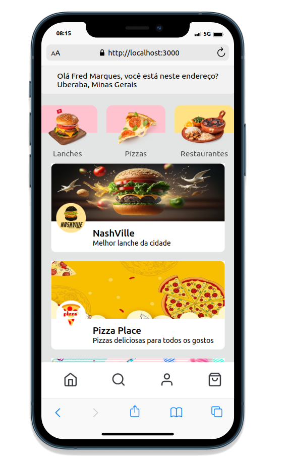

# MPV Delivery APP

## Descrição
Projeto de delivery full-stack que permite visualizar restaurantes, produtos e efetuar pedidos. O sistema é responsivo, adaptando-se tanto para desktop quanto para mobile.

## Tecnologias Utilizadas

### Front-end
 - React: Biblioteca de interface do usuário.
 - ContextAPI: Gerenciamento de estado.
 - React-Router-Dom: Navegação na aplicação.
 - Axios: Requisições HTTP.
 - Swiper: Carrossel para a interface.
### Back-end:
 - TypeScript: Superset de JavaScript.
 - MySQL: Banco de dados relacional.
 - Sequelize: ORM para Node.js.
 - Node.js: Ambiente de execução JavaScript.
 - Express: Framework web para Node.js.
 - JWT: Autenticação por token.
 - Bcrypt: Hashing de senhas.
 - Nodemon: Reinicia automaticamente o servidor durante o desenvolvimento.
 - Cors: Middleware para permitir solicitações de diferentes origens.
 - Docker para containers.

 ### Landing Page
 - Página inicial que redireciona para as opções de login ou cadastro.
 

  
  

### Página de Login
 - Página de login com criptografia de senha.

  
  

### Página de Cadastro
 - Página de Cadastro com criptografia de senha.

  
  

### Página Inicial
 - Exibição de restaurantes.
 - Barra de pesquisa por nome, produtos e descrição.
 

  
  

### Página de Detalhes do Restaurante
 - Detalhes do restaurante e produtos.

  
  

### Página do Usuário
 - Exibição de detalhes do usuário.

  
  

